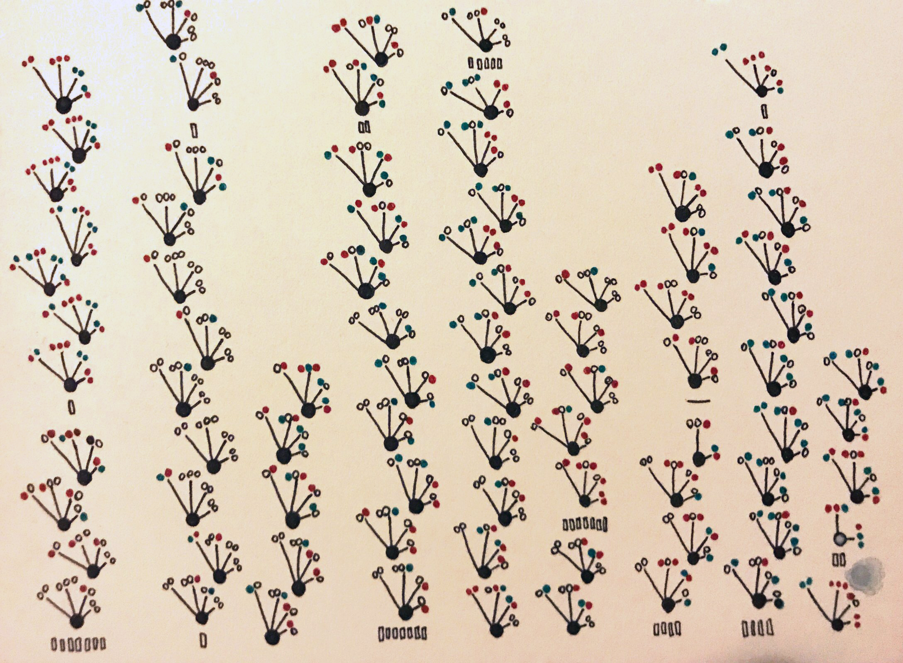
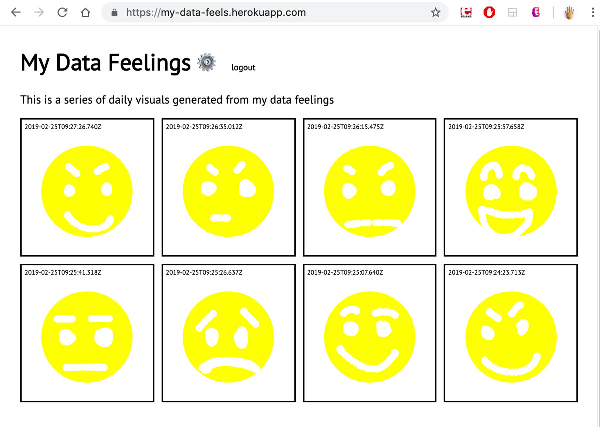
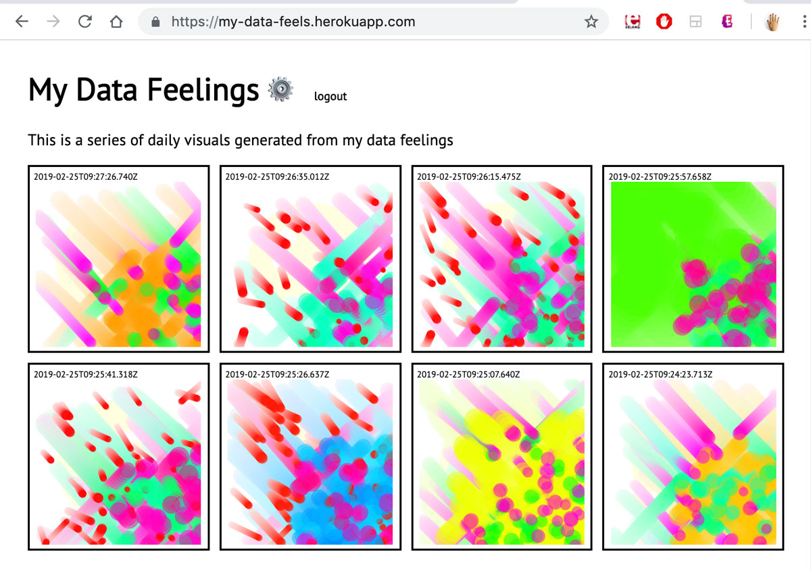
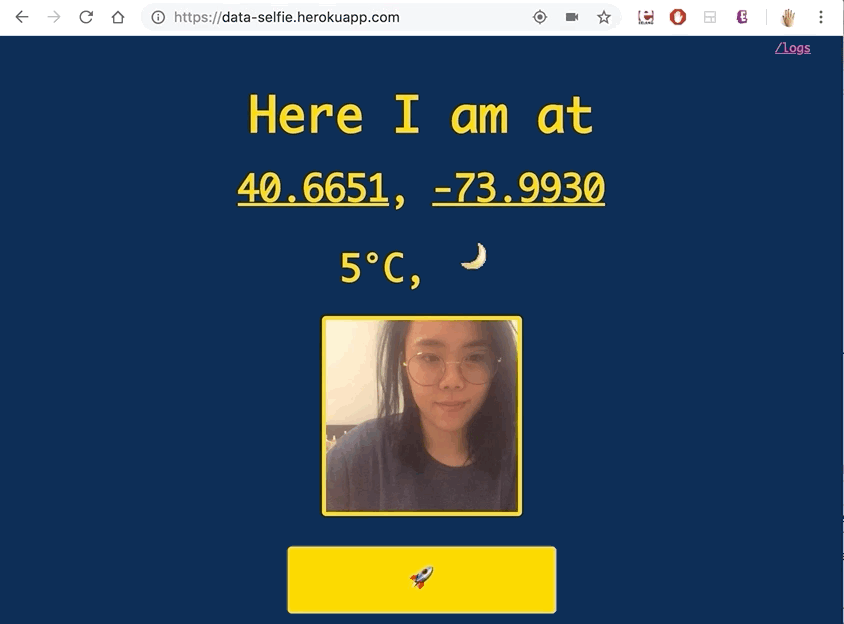
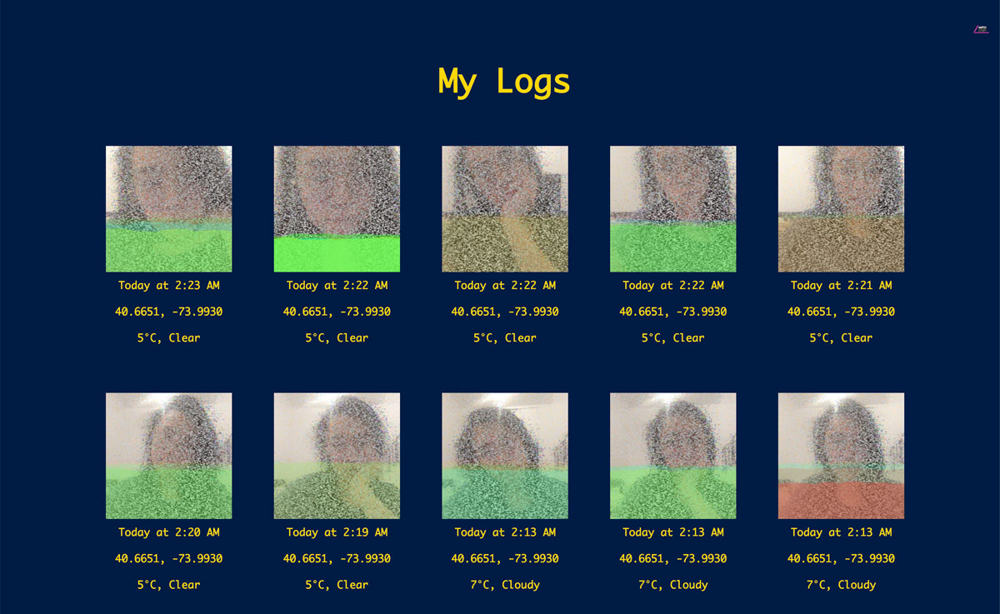

# Quantified Humanists

Repository for Quantified Humanists course, Spring 2019

## [Dear Data](assignments/week2/dear-data.md)

## [Mood Tracking through Smiley Faces](https://github.com/js6450/quantifiedHumanists/blob/master/assignments/week3/my-data-feels.md)

## [Selfie Tracking with Emotion Detection](https://github.com/js6450/quantifiedHumanists/blob/master/assignments/week4/data-selfie-app.md)

