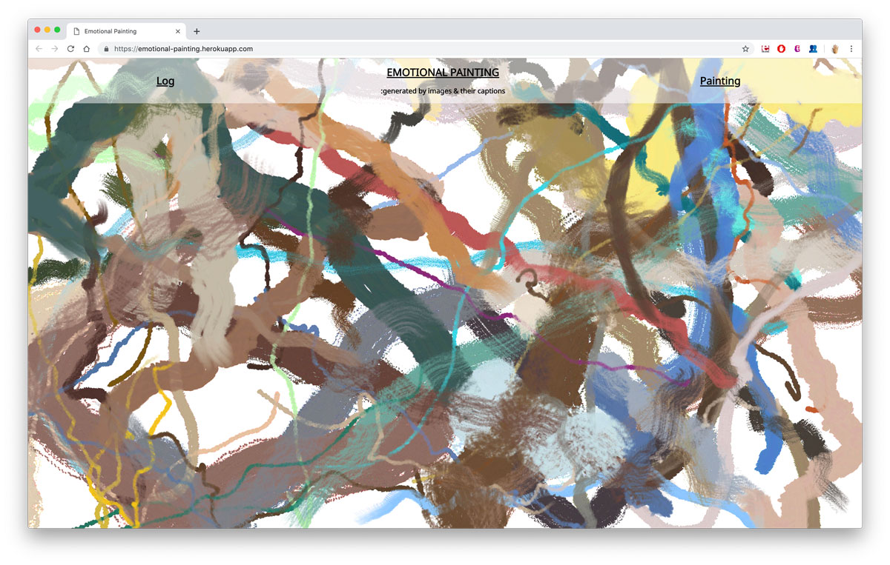
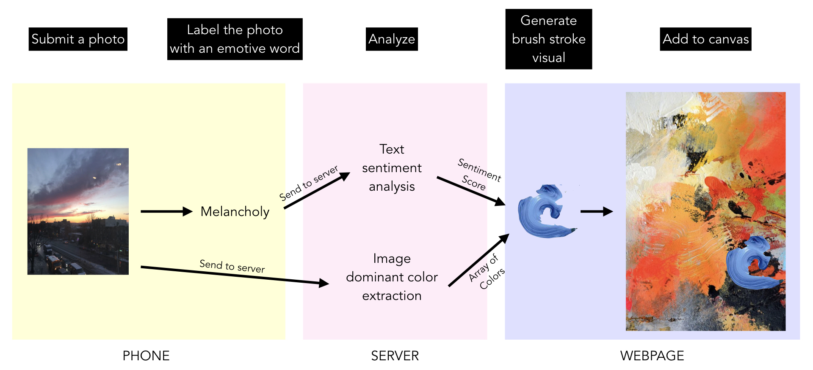
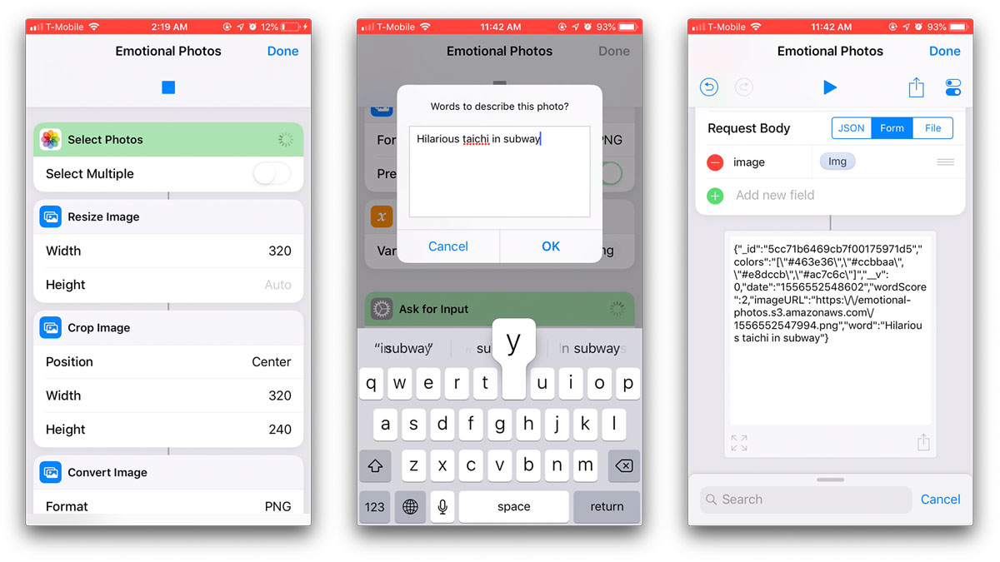
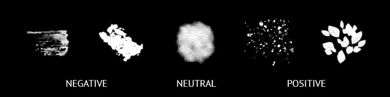

# Emotional Painting

[Go to the project website on Heroku](https://emotional-painting.herokuapp.com/) and here is [link to project presentation](https://docs.google.com/presentation/d/1U6HEltr3MK0WNwCqH4WPZQlSYG0CY3DJxNG3z3djHhk/edit?usp=sharing).

Emotional Painting is a data visualization of photos and their captions that I've collected over month of April 2019. I wanted to analyze the moments of my life captured by photos by writing short captions about the photos then visualizing them as paintings by using data of the text sentiment analysis and dominant colors of the photos.

The website has three modes of viewing. The landing page first shows a grid of photos and each entry has the caption text with its analysis overlayed on top of the photo. The painting strokes generated based on the text sentiment score and dominant colors start being drawn from where the photo is being displayed.

The log view of the website just shows the photo and its text overlay on the top, without the drawing of the painting strokes.

The painting view only shows the view of the painting, without the photo and text shown behind the painting in the main view.

