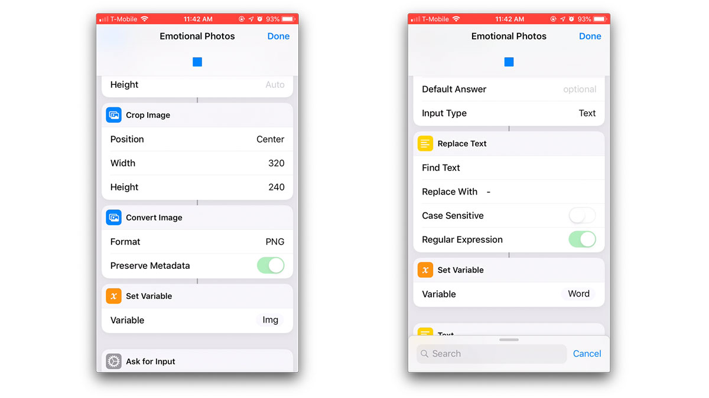

# Emotional Painting

[Go to the project website on Heroku](https://emotional-painting.herokuapp.com/) and here is [link to project presentation](https://docs.google.com/presentation/d/1U6HEltr3MK0WNwCqH4WPZQlSYG0CY3DJxNG3z3djHhk/edit?usp=sharing).

Emotional Painting is a data visualization of photos and their captions that I've collected over month of April 2019. I wanted to analyze the moments of my life captured by photos by writing short captions about the photos then visualizing them as paintings by using data of the text sentiment analysis and dominant colors of the photos.

The website has three modes of viewing. The landing page first shows a grid of photos and each entry has the caption text with its analysis overlayed on top of the photo. The painting strokes generated based on the text sentiment score and dominant colors start being drawn from where the photo is being displayed.

The log view of the website just shows the photo and its text overlay on the top, without the drawing of the painting strokes.

The painting view only shows the view of the painting, without the photo and text shown behind the painting in the main view.

## Submitting the Data

I had originally created a diagram of the workflow of the project for my proposal, and I've managed to stick to the original plans of creating a shortcuts app for submitting photo & caption to the server.

The technical challenge that I set for myself for this assignment is to use Amazon S3 storage service to store all my images instead of base64 strings as I had previously done either in MongoDB or NeDB. I used [Multer](https://github.com/expressjs/multer) to connect to the S3 bucket that I made for this project for a single image upload. I had some difficulty with combining the api post request for both image file and text at the same time so I decided to pass on the text input for my image captions as a query string.

Before the post request, I had to do some preprocessing in the shortcuts app to reformat the images and text. I cropped the images to 320px width and 240px height and converted them to png files. This was because for some of the images that I had on my phone, for some reason, I got errors saying that their data types were video/mp4, which makes me think that those images might have been live images, instead of pure images. For the text caption input, I replaced spaces with "-" dash characters to make the string url friendly query strings.

## Analysing the Data

When I received the image and caption in the post request, I used the [Sentiment](https://www.npmjs.com/package/sentiment) npm module to run text analysis on the sentence, which gave me a score between -5 and 5, where -5 was very negative sentiment, 0 was neutral and 5 was very positive sentiment. I used [Splashy](https://www.npmjs.com/package/splashy) npm module to extract dominant colors of the image. This module was the one that I could find that took image urls instead of files to do color extraction. The return values of colors were in arrays of hexadecimal color values.

After using these tools for analysis, I stored the following data in my MongoDB data table:
* Date
* Link to image stored in Amazon S3
* Caption text
* Caption text sentiment score
* Dominant colors

## Rendering Webpage & Painting

## Reflection

* I think this project will really come to show its meaning when it is done over months to see what the differences are between the paintings. Right now the painting has nothing to compare with and it would be nice to see how it is different from the past months.
