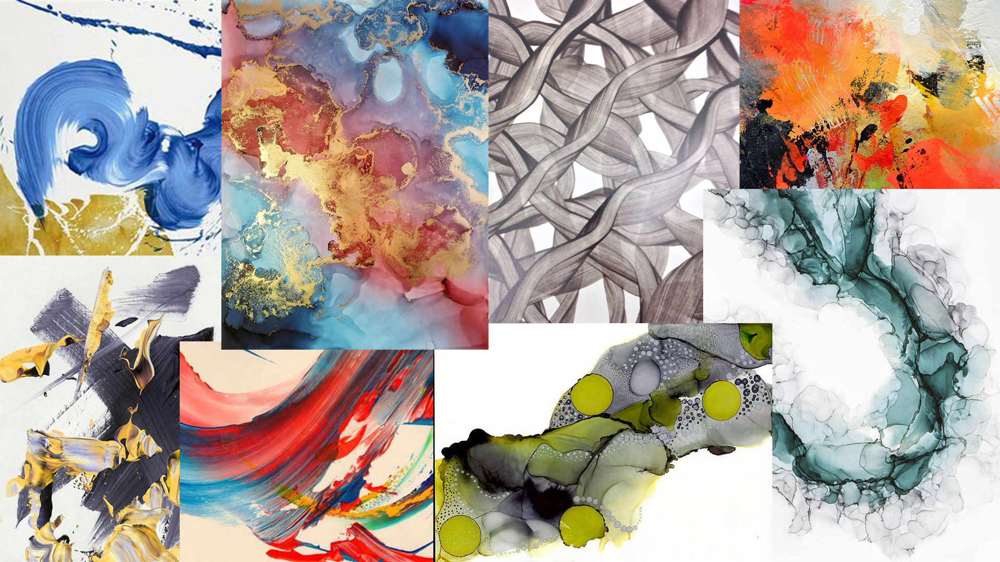
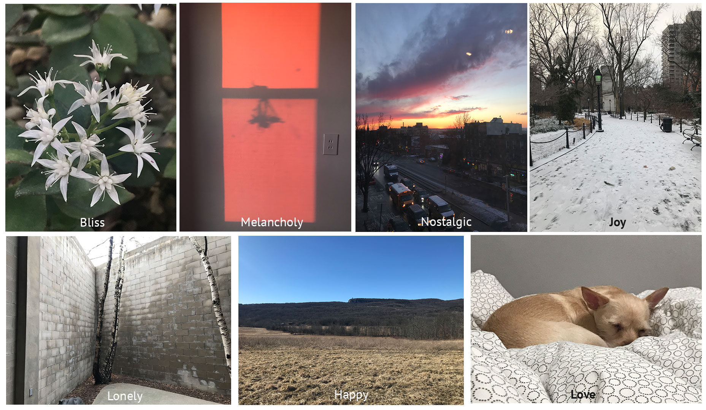

# What does my emotion look like?

Images that I capture embody emotions.

Creating a new image of emotions.

## Background Research:

* Using Convolutional Neural Networks (CNN) for image sentiment analysis
* [Emotion Detection and Sentiment Analysis of Images](https://www.cc.gatech.edu/~hays/7476/projects/Aditi_Vasavi.pdf), Vasavi Gajarla and Aditi Gupta
* [Google Cloud Vision](https://cloud.google.com/vision/)

## Moodboard:

## Hypothesis / Definition of questions:

* Are there similiarities in images 

## Goals:

## Sketches / Technical Considerations:

## Presentation of Proposal:

