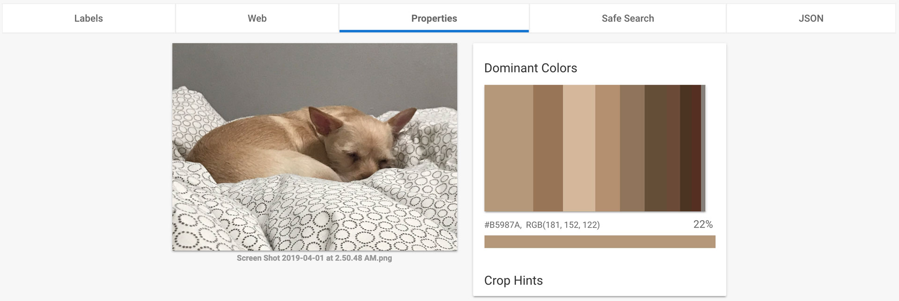

# What Do My Feelings Look Like?

For my final project, I am planning to record my feelings through images and create a new visual using the images as inputs. 

Images are associated with and evokes emotions, whether they are the feelings that prompted me to capture the moment or what I feel when looking at the image. I would like to create a record of my feelings through two inputs: 1) an image that describes the emotion and 2) a one word label of the emotion. Below image is an example of what the record may look like - pairs of an image and a word.

With the data that I submit, I would like to create a digital painting that represents a summary of the recorded feelings. Every time an entry is submitted, an additional "brush stroke" will be added to the digital canvas.

## Background Research:

* Google search of words "sad", "happy", "lonely" and "excited" shows similarities in images that are associated with the words.

* I searched with the term "image sentiment analysis", as this is what I am trying to do manually by labelling the images that I record with an emotion word. The search result included papers (Emotion Detection and Sentiment Analysis of Images](https://www.cc.gatech.edu/~hays/7476/projects/Aditi_Vasavi.pdf), Vasavi Gajarla and Aditi Gupta) and code that talk about sentiment analysis on images using machine learning and Convolutional Neural Networks.

* It also returns results of cloud based machine learning APIs such as [Google Cloud Vision](https://cloud.google.com/vision/) and [Amazon Rekognition](https://aws.amazon.com/rekognition/) that analyse images to extract its components. After trying out the Google Cloud Vision, the two useful things that I may consider using for my project are the image labels and dominant colors in the images.

## Moodboard:

For the final output of the digital painting, below is a moodboard of the visual aesthetic style that I am aiming for the whole painting as well as the style of the individual "feeling" brush strokes.

## Hypothesis / Definition of questions:

* Is there a recognizable pattern of images in relation to their emotion words? Are their similarities in images that I label as "happy" and what are the differences in images that I consider "happy" from those that I label "sad"?

## Goals:

The feelings that we associate with images are subjective. As my quick research on image sentiment analysis shows, there are efforts in predicting the emotions people associate with a given image. I think this speaks to the argument that Gina Neff and Dawn Nafus makes in their book *Self-Traking* about the technologies defining what "normal" is. I would like to express my thoughts about the over-generalization of machine learning algorithms in defining what we are should feel when looking at an image as well as explore what my "normal" associations of image to sentiment are.

By taking a step further and creating a digial painting using the image and word inputs, I am hoping to clarify specific characteristics and trends through abstraction of high fidelity images to simple "brush strokes".

## Sketches / Technical Considerations:

For this project, below are list of technical components that I am planning to create:
* Basic Shortcuts app that uploads an image and its feeling word.
* Database that stores all the images and the associated keywords.
* Server that extracts aspects of the images that will be used to create the digital painting of emotions.
* Web view of the digital painting that builds up over time with more input.

## Presentation of Proposal:

[Link to Google Slides](https://docs.google.com/presentation/d/1bPqzZvrEv2kw7KjkittPcHzug24fkzms-DPqMVXX1lw/edit?usp=sharing)
