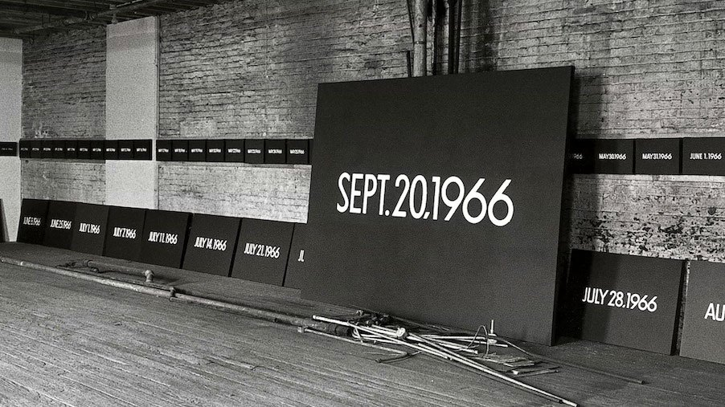
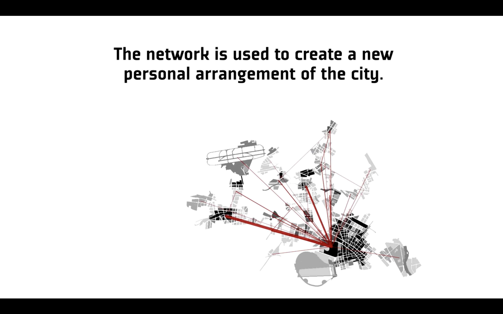
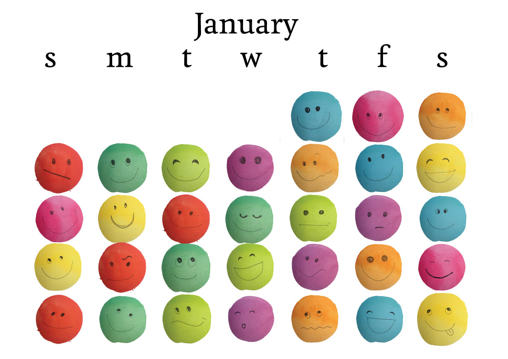

# Research on Quantified Self Projects

## Today (1966 - 2013), On Kawara

Image from [Guggenheim Museum](https://www.guggenheim.org/video/on-kawara-date-paintings)

For almost 50 years, On Kawara did a series of paintings collectively known as *Today* series, starting with January 4, 1966. The series consist of paintings on canvas of 8 dimensional variations of date in sans-serif font in white color on monochrome background (gray, red and blue). There were a number of rules to how On Kawara did these paitings, one of which was that if the date painting wasn't finished before midnight of the day, the painting was destroyed. The form and language of how the date is represented depended on the geographic location of where Kawara was at the time. Each of the boxes that contained a date painting were lined with news paper of that day.

There is no one date painting that is identical to one another - because of progression of date, but also because the shade of the monochrome background was hand mixed and the date was hand drawn. There is beauty in repetition, in consistency of rules but also the enormous amount of variation that were embodied in the representation and drawing of the date.

Having had the opportunity to see these paintings at the Guggenheim Museum's [On Kawara - Silence](https://www.guggenheim.org/exhibition/on-kawara-silence) exhibit displayed along the spiral floors of the museum, it was a sight of awe. I think there is a lot of meditative and reflective nature of the piece that strongly resonated with me. I also saw a high level of self awareness that were expressed through these paintings and thought that so much data were embodied through a very seemingly minimal output. 

## Psychogeography (2016), Sabastian Meier and Katrin Glinka

Screencapture from [video of Psychogeography on Vimeo](https://vimeo.com/195647160)

[Psychogeography](http://www.vislab.io/projects/mentalmaps/) is a mental map modelling with georeference personal activity data collected using a discontinued application called Moves, rendered both digitally and physically through 3D priniting.

*Psychogeography* is not like any other georeference tracking visualizations that I have seen before. It is not mere representations of locations and paths that someone has traveled through during a period of time, but Meier and Glinka used the data as a starting point to reconstructing and rendering a mental map of what the person behind the collected georeference data considers to be the "familiar areas", or as they call it the personal arrangement of the city. I've seen a number of my friends track georeference data mostly to see which part of the world that they've covered through travelling and how many cities that they've been to and so on. This project is different in the way that the purpose of collecting georeference data isn't to see how far or how many, but to show how one perceives the city that they have lived in for an extended period of time. It made me curious to find out how I perceive New York to be and whether I have completely "missed out" in some areas of the city more than others. Although this project is showcased with one particular set of data of an individual, it would be interesting to see representations of multiple individuals dataset in comparison.

## Draw a Face a Day, Ellis Bartholomeus

Image from [Draw a Face a Day project page on Quantified Self](http://quantifiedself.com/2016/07/ellis-bartholomeus-draw-face-day/)

Ellis Bartholomeus presented her project *Draw a Face A Day* at the QSEU15 Conference, which is a project consisting of cartoon-like faces that she drew for 6 months (at the time). She describes that the practice started from receiving a book "Face A Day" which is a self-tracking book that prompts you to write about different aspects of your day such as the date, weather and what meals you had, but most interestingly, represent the day with a face.

The most interesting aspect of this project to me was the fact that Bartholomeus challenged herself to quantify the seemingly unquantifiable. She takes different approaches to attempt to figure out how to collect the faces that she drew for 6 months as quantifiable data such as by also giving herself a point system to, as she describes it, reward her day that ranged between 1 (being bad) and 3 (being a great day) to accompany her faces. She also analyized the height of the smile (or none-smile) of the faces that she drew to quantify the happiness of the smile. I think it is an interesting approach to quanitify oneself with a dataset that is hard to quantify, or rather, has too many aspects to quantify.

Bartholomeus talks a little about how she thought this method of self tracking was fun and recommended her mother of using the book, but that she had quickly lost interest in doing so by saying that she had "run out of faces to draw". I think the fundamental difference between someone like Bartholomeus and her mother was whether one has a system / set of rules or does not. Even if Bartholomeus thought that the faces that she drew were hard to be quantifiable, she was still drawing them with a set of rules (I don't know whether she did this intentionally or not), which is why there could be a consistency and clear differences in the faces that she drew that could be analyzed.
