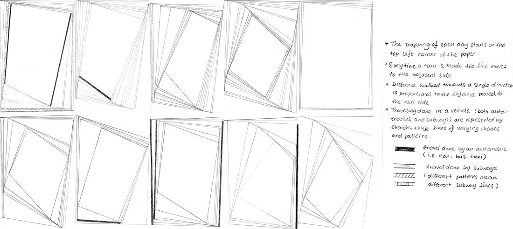

# Reflection on Quantified Self

There was a period of time that I was very consistent in keeping a journal. One of the first homeworks that I received in my life (in preschool) was to keep a drawing journal for which I had to draw something to accompany my diary entry. I had been keeping up with the practice of writing journal entries up until my sophomore year of college. There really wasn't a reason for stopping at the time, but when I reflect on it now I think it had a lot to do with the fact that I was making up an excuse to myself that I had no time for it. But also I was growing tired as well as accustomed to the automatic and digital collection of my every day that happened on my electronic devices. I didn't have to make too much of an effort to try to document my days, or rather moments of the days that I wanted to remember mostly through photo and video taking and text messages between people. When observing a number of my friends take on the trend of self tracking, mostly through wearable bands such as fitbit, I didn't think it would be interesting to do so for myself mostly because I had little interest in tracking my health related data and also because of the weird filling of being tied and trapped by the act of wearing a digital device around my wrist at all times.

However, I do see that there is value in collecting data about oneself for an extended period of time. When doing research about projects related to Quantified Self this week, I discovered Ellie Bartholomeus' project *Draw A Face A Day* and watched a video of her talking about the project. She describes her motivation for self tracking to see what motivates her and her end goal being to make herself happier. I don't know if my reasons for self traking would be the same as hers. I think my motivation for self tracking (as of now) is just the joy of seeing a pattern emerge and hoping to see a pattern in things that I didn't think there would be. I want to see if events and data of my life have correlations that I didn't think that they would have. The biggest motivation for self tracking would be to use the data for my works. I have become used to using data in my practice of making things / creative coding whether it is real-time data through sensors and cameras or it is a set of json or csv files that I have to parse through. But I have yet to use my own personal data. I can safely say without much doubt that On Kawara is one of my favorite artists and the reason for such statement is the fact that I think the messages that he emits through his work are very strong and there is so much of himself in all of his artworks. I am hoping to see if I can create a stronger meaning and emotion through my works by incorporating my own personal data.

Having said all of above, while thinking about my relationship with self tracking, I realized that I have actually created a work that could be cassified as a quanitified self project for an assigment for a visual design class.

I had called this piece [Algorithmic Drawing: Walk around New York](http://jiwonshin.com/create/walk.html) and didn't think to write much about the work at the time but from what I remember, my inspiration came mostly from Sol Lewitt's Drawing Series and I was interested in hand drawings generated through a set of rules. Looking back at it now, it was my way of representing and self tracking my day.

With an interest and desire to start tracking my every day activities, I recently started using the [Reporter App](http://reporter-app.com/). So far I only have 35 report entries but I am wondering and looking forward to see where it would take me and what kinds of interesting facts that I would discover about my behaviors.
