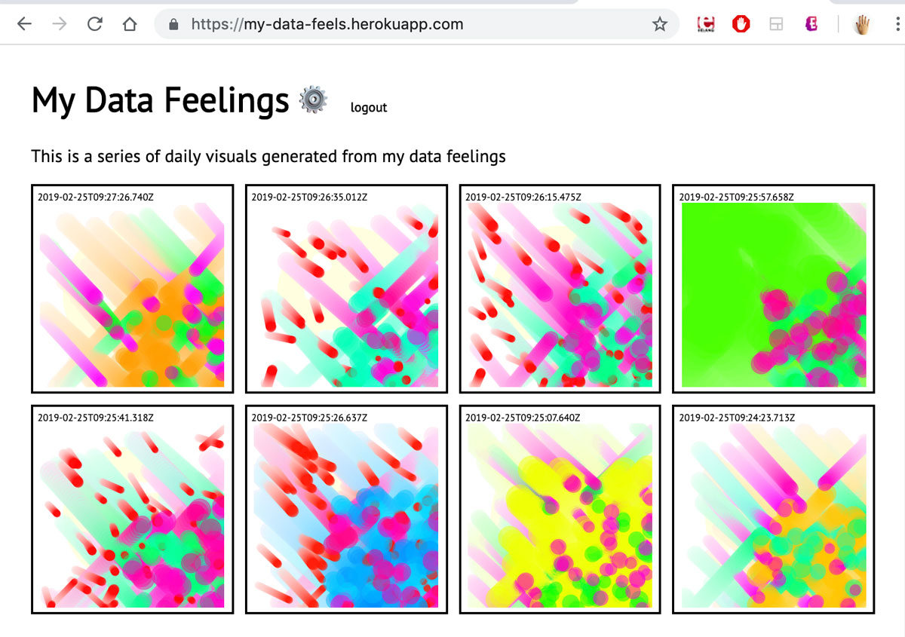

# My Data Feels: Personal Data Visualization Web App

[Link to deployed app on Heroku](https://my-data-feels.herokuapp.com/)

For this week's assignment of creating personal data visualization web app, I was inspired by the [Draw a Face a Day](http://quantifiedself.com/2016/07/ellis-bartholomeus-draw-face-day/) project by Ellis Bartholomeus. This project was one of the three projects that I researched and wrote about for my [project review in week 1](https://github.com/js6450/quantifiedHumanists/blob/master/assignments/week1/project-review.md).

I wanted to create a web app that recorded the current state of my emotions through the act of drawing smiley faces. To achieve this, I used Joey's [My Data Feelings tutorial](https://joeyklee.github.io/my-data-feelings/#/) as base and edited where it was needed.

## Admin Console
The admin console appears after the user (me) successfully logs into the system. I decided to replace the forms that are here in Joey's tutorial to a simple canvas created in p5, that would allow me to draw smiley faces and add to the data base.


I had to decide what data I wanted to add to the database. I also thought that it would be easier to do all the computation that I wanted to do to analyze the emotions of the smiley face to create visuals. Knowing that I wouldn't be able to get the exact details of the emotion that the smiley face depicts to human eye as numbers, I tried to break down the drawing to 3 significant areas: mouth, eyes and eyebrows.


Analyzing different areas of smiley face:
1. Mouth: lower half of the face.
  * Has minimum point and maximum point.
  * Has width and height
  * If minimum point is further away from center of face, it means the mouth is shaped more like a sad face.
2. Eyes: upper lower part of the face.
  * Has width and height
  * If bigger eyes, then the overall emotion is intensified.
3. Eybrows: upper-most part of the face.
  * Has width and height
  * Has two maximum points.
  * If average of maximum points is further away from center of face, it means it is angry. If it is closer to the center of face, it means it's sad.
  
With the very basic set of rules / patterns of my smiley faces, I devised a very crude scoring system.

```
let mouthEmotion = (mouthMinDist / (w / 2)) * (mouthHeight * 3 / mouthWidth);
console.log("mouth", mouthEmotion);

let eyebrowEmotion = (avgEyebrowMinDistance / (w / 2));
console.log("eyebrow", eyebrowEmotion);

let eyebrowIntensity = avgEyebrowHeight / avgEyebrowWidth;
console.log("eyebrow intensity", eyebrowIntensity);

let eyeEmotion = (avgEyeWidth + avgEyeHeight) / (w / 2);
console.log("eye", eyeEmotion);
```

Again, this scoring system is not very scientific, but after drawing different smiley faces and adjusting the functions, I decided to settle with this, as it does roughly reflect the overall emotion of the drawn smiley face.

I also decided to store all the pixels that are drawn in an array, because I realized that the total number of pixels used to draw each smiley faces is not as big as I thought they would be. The final payload of data for each emotion ended up being as below:

```
const payload = {
  width: w,
  total: totalEmotion,
  mouth: mouthEmotion,
  eyebrow: eyebrowEmotion,
  eyebrowIntensity: eyebrowIntensity,
  eye: eyeEmotion,
  pixels: this.newFeeling.pixels
}
```

I needed to also store the width of the smiley face, as at this point I decided to recreate the drawn smiley faces in the visualization page.

## Visualization

The visualization page, when first opened, shows the recreated drawings of the smiley faces entered in.


Once the mouse is pressed, the particles generated based on the computed values fill up each of the items in the grid.



The reason for the colored bouncing ball particles is to act as metaphore of the feelings overtaking each cell of the recorded moment. The colors of each particle match the emotion scoring system of each of the three components of the smiley face (mouth, eye, eyebrows), as well as the radius and speed.

I was actually quite surprised at the variations that each of the smiley faces generated and it sort of seemed to reflect the general mood of the drawn faces.

## Challenges

Overall, I think the end product serves as a good rapid prototype, but I think it does lack the finess that it needs to have to translate smiley face to the generated particles.

Also, I didn't think about this until I was too far in, but it did seem a little funny that I was turning something that was already a visualization of my emotion into another visualization. Granted, I think the end visualization of the colored particles do come as a product of my attempt of trying to analyze my own feelings. But it still does seem a little weird to turn something that shows emotion quite well, into something more abstact and indirect.

One technical challenge was that I didn't realize that I had based a lot of my computations of turning pixel data into other numbers on the width and height of the browser window size. Consequently, the web app currently works best if the browser window width is half the size of the computer monitor width (because I was testing and developing in this ratio). I should have thought about it, but the size variation effected more than I thought it would because I am working with pixel data.
