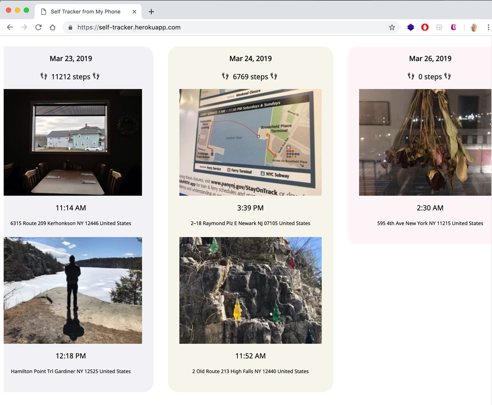

# Quantified Self Intervention

You can view the website on Heroku [here](https://self-tracker.herokuapp.com/) and code repo is available [here](https://github.com/js6450/quantified-self-tracker).

For my Quantified Self Intervention assignment this week, I thought about my attempts of logging my daily activities. I had started to use the [Reporter App](http://reporter-app.com/) that was introduced at the beginning of this course, but since the beginning of this month, I had failed to deligently log my entries on the app. The app sends push notifications at approximately 6 hour intervals, with some randomness to the selected time frame, but even when I get the push notification, I am either not around my phone or not in a place / time to enter in the data that I am prompted to enter.

I thought about the reason why I was failing to log entries to the Reporter app, and have concluded with 2 major reasons. 1) Although it sounds silly, but I don't want to spend too much time on loggin my data. 2) It doesn't have a good visual feedback of all the data that I've entered, because the Reporter app (in my point of view) requires a large amount of data to be accumulated to start to see some patterns that emerge from it.

For my intervention, I had two things in mind. Either make something that is very hands-on and physical so that the process itself is meditative and actually allocate a lot of my time doing every entry or to make something that is extremely automated but very visual.

I went with the later option, because I wanted to create some sort of digital version of photo journal for a while. After looking at the vidoes that Joey sent about using the [Shortcuts](https://support.apple.com/guide/shortcuts/welcome/ios) iOS app to create mini apps using iOS native tools, I created my own that takes a random photo taken on that day and also pulls out time taken and location taken of that photo. I later decided to put in the steps count from my Apple Health data as well as part of an exploration of what other data that I could pull from my phone.

I added the mini app that I created in Shortcuts on my home screen and by clicking on the app logo, it automatically selects a random photo from my photo gallery on my phone and sends the data to a server on Heroku. I used Joey's [very basic express auth example](https://github.com/joeyklee/very-basic-express-auth-example/tree/with-mongodb) using MongoDB as skeleton code for my web app and added more code to accomodate for the images. I struggled a little at the beginning because I had anticipated the image data to be recieved as Buffer data, but after a while I realized that the base64 encoding can just be saved as String data to be used as source for image tags in html.

I made the webpage style to mimic photo diaries, with photos grouped per day and scrolling horizontally.

## For Future

I would like to figure out a way of completely automating this process. Could I set a timer for the app to run at a specific time every day? I added the Siri shortcut to the app, but for some reason, I have not been able to actually run it via Siri. 

I would also like to add more data to send to server, to try to capture as much of the data I am generating every day on my phone.
